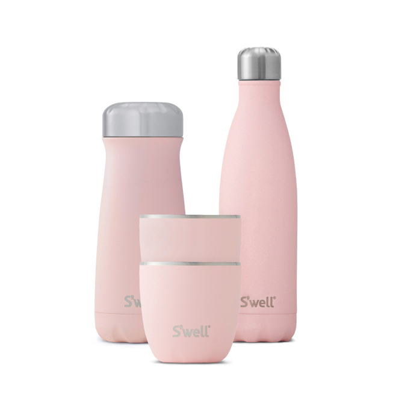

<!--{"blockType":"simpleImage","attr":{"withBorder":true,"withBackground":true,"stretched":false,"hideCaption":true}}-->

<!--{"blockType":"simpleImage","attr":{"withBorder":false,"withBackground":false,"stretched":false,"hideCaption":false}}-->

